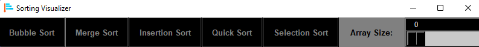

# Sorting Visualizer

This program creates random array with numbers in range of 100 and demonstrates some sorting algorithm with live graphs.

How to use:

Slide the scale to choose the array size.

Click on the wanted sorting type button.

